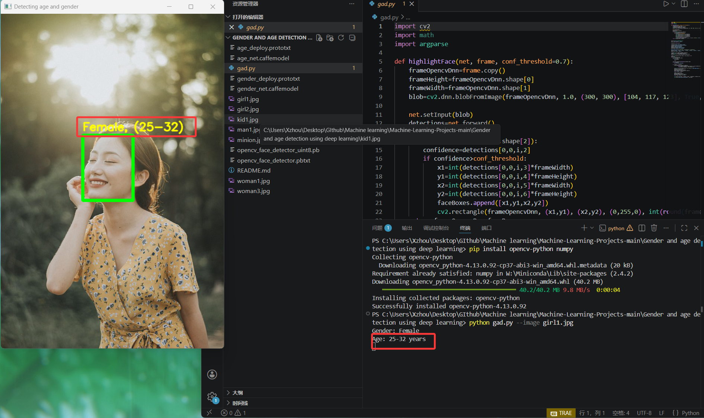
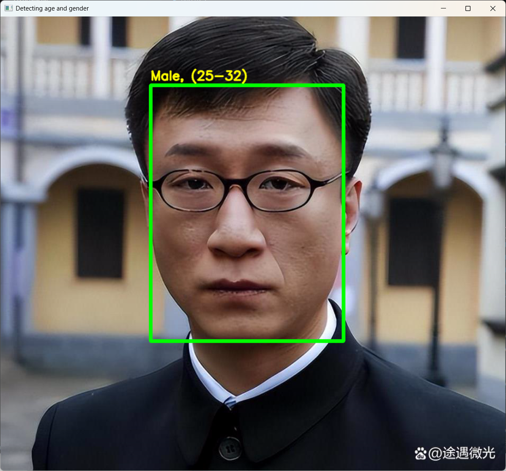
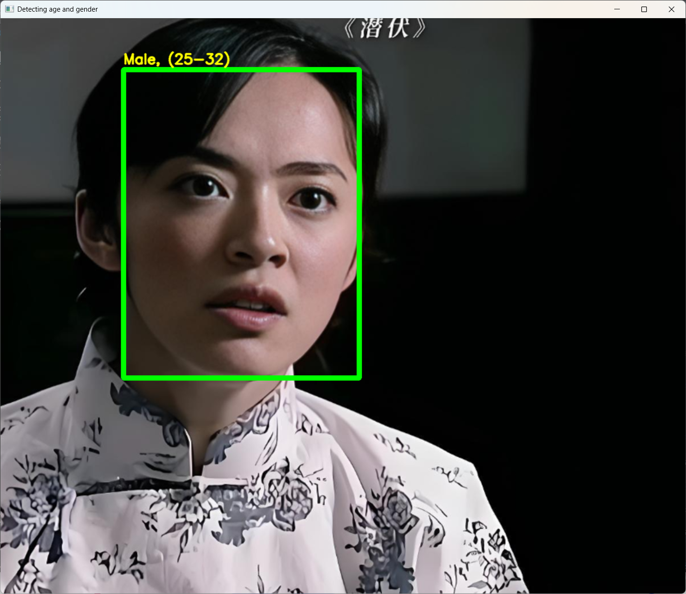
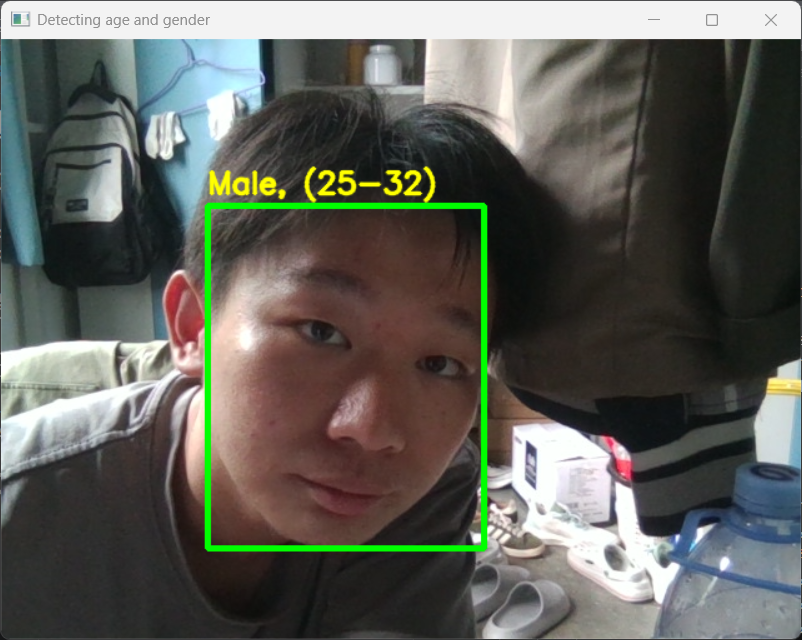

<div align="center">

# 🧑‍🤝‍🧑 Gender & Age Detection — OpenCV Deep Learning

[](https://www.python.org/)
[](https://opencv.org/)
[](http://caffe.berkeleyvision.org/)
[](https://talhassner.github.io/home/projects/Adience/Adience-data.html)
[](../LICENSE.md)

> Detects **faces** in images or a live webcam feed and predicts each person's **gender** (Male/Female) and **age range** across 8 age buckets — using three pre-trained deep learning models loaded via **OpenCV DNN**.


## 👥 小组信息

| 项目 | 内容 |
|------|------|
| **小组名称** | 性别年龄检测复现小组 |
| **小组成员** |肖周乐（2025303120176）@Gladsxzhou, 黄张赛（2025303120183）@hzs12 |
| **项目名称** | Gender and age detection using deep learning 复现 |
| **原始仓库** | [shsarv/Machine-Learning-Projects](https://github.com/shsarv/Machine-Learning-Projects/tree/main/Gender%20and%20age%20detection%20using%20deep%20learning) |

---

## 📸 项目结果测试

对原始项目提供的 `girl1.jpg` 进行检测，模型输出如下：



*上图显示了人脸检测框、性别预测（Female）和年龄预测（25-32岁）。*

---

## 🔁 项目复现测试

在另一台独立电脑上，克隆仓库并严格按照步骤执行，得到一致输出：





*复现环境：Windows 11，Python 3.10，依赖安装后运行 `python gad.py --image girl1.jpg`，输出与原始结果一致。*

---


## 🛠️ 环境搭建

 系统要求
 
- 操作系统：Windows / macOS / Linux  
- Python 版本：3.7 – 3.11（推荐 3.10）

安装依赖

方法一：使用 pip（推荐）

打开终端（命令提示符 / PowerShell / bash），进入项目根目录，执行：
pip install -r requirements.txt

方法二：使用 conda


## 模型文件
本项目的所有预训练模型（.caffemodel、.pb、.prototxt）已直接存放在仓库中，无需额外下载。如果你重新克隆仓库，文件会自动包含。


[🔙 Back to Main Repository](https://github.com/shsarv/Machine-Learning-Projects)

</div>

---

## 📌 Table of Contents

- [About the Project](#-about-the-project)
- [How It Works](#-how-it-works)
- [The Three Models](#-the-three-models)
- [Age & Gender Classes](#-age--gender-classes)
- [CNN Architecture](#-cnn-architecture)
- [Project Structure](#-project-structure)
- [Getting Started](#-getting-started)
- [Tech Stack](#-tech-stack)
- [References & Citation](#-references--citation)

---

## 🔬 About the Project

This project builds a **real-time gender and age detection system** using three pre-trained models served through OpenCV's DNN module — no model training required. Based on the DataFlair deep learning project, it uses:

- A **TensorFlow SSD** model for face detection
- A **Caffe CNN** (Levi & Hassner, 2015) for gender classification
- A **Caffe CNN** (Levi & Hassner, 2015) for age prediction

The script (`gad.py`) accepts a **static image** via `--image` argument or runs on a **live webcam feed**, draws bounding boxes around detected faces, and overlays the predicted gender and age range on each face.

---

## ⚙️ How It Works

```
Input: Image / Webcam Frame
              │
              ▼
  blobFromImage(frame, 1.0, (300×300), [104,117,123])
              │
              ▼
  ┌─────────────────────────────────────┐
  │  Face Detection (TensorFlow SSD)    │
  │  opencv_face_detector_uint8.pb      │
  │  opencv_face_detector.pbtxt         │
  └─────────────────────────────────────┘
              │
              ▼
  For each face (confidence > 0.7):
    Crop face ROI + 20px padding
    blobFromImage(face, 1.0, (227×227), MODEL_MEAN_VALUES)
              │
        ┌─────┴──────┐
        ▼            ▼
  ┌──────────┐  ┌──────────┐
  │  Gender  │  │   Age    │
  │  Network │  │  Network │
  │ (Caffe)  │  │ (Caffe)  │
  └──────────┘  └──────────┘
        │            │
        ▼            ▼
   Male/Female   Age Bucket
        └─────┬──────┘
              ▼
  "Gender: Male  Age: (25-32)"
  overlaid on bounding box
```

**Key preprocessing constant:**
```python
MODEL_MEAN_VALUES = (78.4263377603, 87.7689143744, 114.895847746)
```
> BGR mean values subtracted from every face blob to normalize for illumination variation across the Adience training data.

---

## 🧠 The Three Models

| Model | Framework | Files | Purpose |
|-------|-----------|-------|---------|
| **Face Detector** | TensorFlow SSD | `opencv_face_detector_uint8.pb` + `opencv_face_detector.pbtxt` | Detect face bounding boxes |
| **Gender Net** | Caffe (Levi & Hassner) | `gender_net.caffemodel` + `gender_deploy.prototxt` | Classify Male / Female |
| **Age Net** | Caffe (Levi & Hassner) | `age_net.caffemodel` + `age_deploy.prototxt` | Predict one of 8 age ranges |

```python
faceNet   = cv2.dnn.readNet("opencv_face_detector_uint8.pb", "opencv_face_detector.pbtxt")
ageNet    = cv2.dnn.readNet("age_net.caffemodel",    "age_deploy.prototxt")
genderNet = cv2.dnn.readNet("gender_net.caffemodel", "gender_deploy.prototxt")
```

---

## 🏷️ Age & Gender Classes

**Gender** (2 classes):
```python
genderList = ['Male', 'Female']
```

**Age** (8 buckets):
```python
ageList = ['(0-2)', '(4-6)', '(8-12)', '(15-20)',
           '(25-32)', '(38-43)', '(48-53)', '(60-100)']
```

> Age is treated as a **classification problem** over 8 discrete ranges rather than regression — Levi & Hassner (2015) found classification over predefined buckets more robust than direct regression on the Adience benchmark.

---

## 🏗️ CNN Architecture

Both age and gender models share the same architecture — a lightweight CNN similar to CaffeNet/AlexNet, trained on the **Adience dataset**:

```
Input: 227 × 227 × 3 face crop (mean-subtracted)
         │
Conv1: 96 filters, 7×7 kernel → ReLU → MaxPool → LRN
Conv2: 256 filters, 5×5 kernel → ReLU → MaxPool → LRN
Conv3: 384 filters, 3×3 kernel → ReLU → MaxPool
         │
FC1: 512 nodes → ReLU → Dropout
FC2: 512 nodes → ReLU → Dropout
         │
Softmax
├── Gender Net output: 2  (Male / Female)
└── Age Net output:    8  (age range buckets)
```

---

## 📁 Project Structure

```
Gender and age detection using deep learning/
│
├── gad.py                              # Main script — detection pipeline
│
├── age_net.caffemodel                  # Age model weights (Caffe, ~44 MB)
├── age_deploy.prototxt                 # Age model architecture
├── gender_net.caffemodel               # Gender model weights (Caffe, ~44 MB)
├── gender_deploy.prototxt              # Gender model architecture
├── opencv_face_detector_uint8.pb       # Face detector weights (TensorFlow)
├── opencv_face_detector.pbtxt          # Face detector architecture
│
├── girl1.jpg                           # Sample test images
├── girl2.jpg                           # ↑
├── kid1.jpg                            # ↑
├── man1.jpg                            # ↑
├── minion.jpg                          # ↑
├── woman1.jpg                          # ↑
├── woman3.jpg                          # ↑
│
└── README.md
```

> **Note:** The `.caffemodel` files (~44 MB each) may not be included in the repository due to GitHub's file size limits. If missing, download them from [Tal Hassner's Adience page](https://talhassner.github.io/home/projects/Adience/Adience-data.html) and place them in the project root.

---

## 🚀 Getting Started

### 1. Clone the repository

```bash
git clone https://github.com/shsarv/Machine-Learning-Projects.git
cd "Machine-Learning-Projects/Gender and age detection using deep learning"
```

### 2. Set up environment

```bash
python -m venv venv
source venv/bin/activate        # Linux / macOS
venv\Scripts\activate           # Windows

pip install -r requirements.txt
```

### 3. Run on a sample image

```bash
python gad.py --image girl1.jpg
# Output → Gender: Female  Age: (25-32) years
```

Try the included sample images:

```bash
python gad.py --image man1.jpg
python gad.py --image kid1.jpg
python gad.py --image woman1.jpg
python gad.py --image minion.jpg   # 🤔
```

### 4. Run on live webcam

```bash
python gad.py
# No --image flag → defaults to webcam (index 0)
# Press Q to quit
```

---

## 🛠️ Tech Stack

| Layer | Technology |
|-------|-----------|
| Language | Python 3.7+ |
| Computer Vision | OpenCV (`cv2.dnn`) |
| Face Detection | TensorFlow SSD (ResNet-10 backbone) |
| Age / Gender Models | Caffe (Levi & Hassner, 2015) |
| Argument Parsing | `argparse` |
| Numerical Processing | NumPy |

---

## 📚 References & Citation

```bibtex
@inproceedings{Levi2015,
  author    = {Gil Levi and Tal Hassner},
  title     = {Age and Gender Classification Using Convolutional Neural Networks},
  booktitle = {IEEE Workshop on Analysis and Modeling of Faces and Gestures (AMFG),
               at the IEEE Conf. on Computer Vision and Pattern Recognition (CVPR)},
  year      = {2015}
}
```

- [Levi & Hassner (2015) — Original Paper & Models](https://talhassner.github.io/home/projects/Adience/Adience-data.html)
- [Adience Benchmark Dataset](https://talhassner.github.io/home/projects/Adience/Adience-data.html)
- [OpenCV DNN Face Detector](https://github.com/opencv/opencv/tree/master/samples/dnn)
- [LearnOpenCV — Age & Gender Classification](https://learnopencv.com/age-gender-classification-using-opencv-deep-learning-c-python/)

---

<div align="center">

Part of the [Machine Learning Projects](https://github.com/shsarv/Machine-Learning-Projects) collection by [Sarvesh Kumar Sharma](https://github.com/shsarv)

⭐ Star the main repo if this helped you!

</div>
